# Vendor API Archiving — Where We Stand

**Updated:** 2026-05-29 · Scope of this iteration: **code + contracts + tests** (infra apply is the next iteration).
See [CONVENTIONS.md](CONVENTIONS.md) for the contract and [plan.md](plan.md) for tracked work.

> **Two axes of "done".** Everything below is correct and tested at the **code/contract** level. Nothing is
> **deployed** yet — no `terraform apply`, no ClickHouse provisioned, no secrets set. So the pipeline is
> *buildable and proven in tests*, not *running in staging*. The diagram colours reflect code-readiness.

---

## Pipeline status

```mermaid
flowchart LR
    subgraph PROD["Producers — vendor-logger (NestJS)"]
        direction TB
        HP["VendorHttpService.call()<br/>build camelCase VendorApiEvent<br/>+ HMAC/mask PII"]:::done
        RB["RingBuffer push()<br/>fail-open, &lt;1ms"]:::done
        DR["SqsDrainService<br/>toWireEvent → snake_case<br/>batch→SQS, re-enqueue/backoff"]:::fixed
        HP --> RB --> DR
    end

    SQS["SQS vendor-events-q<br/>snake_case JSON · SSE-KMS<br/>DLQ after 5 retries"]:::infra

    subgraph LAM["Lambda vendor-archiver"]
        direction TB
        PARSE["parse snake_case wire<br/>passthrough + Lambda-added cols"]:::fixed
        RED["redact for ClickHouse<br/>fail-closed on unparseable"]:::fixed
        PARSE --> RED
    end

    S3["S3 Archive<br/>RAW payloads · KMS + Legal Hold<br/>Object Lock COMPLIANCE"]:::infra
    CH["ClickHouse vendor_api_events<br/>REDACTED · snake_case<br/>ReplacingMergeTree(ingested_at)"]:::infra
    GRAF["Grafana dashboards<br/>vendor_api_calls_total / _latency_ms<br/>+ ClickHouse SQL"]:::fixed
    PROM["Prometheus scrape<br/>+ /metrics endpoint"]:::left
    SM["Secrets Manager<br/>hash salts (mobile/aadhaar)"]:::left

    DR -->|"region: must be ap-south-2"| SQS
    SQS --> PARSE
    RED -->|"① first"| S3
    RED -->|"② second"| CH
    CH --> GRAF
    PROD -.->|prom-client| PROM --> GRAF
    SM -.->|loaded at startup| HP

    classDef done   fill:#0a2e19,stroke:#3fb950,color:#3fb950;
    classDef fixed  fill:#2a1f00,stroke:#d29922,color:#f0c451;
    classDef infra  fill:#0d1f38,stroke:#58a6ff,color:#79b8ff;
    classDef left   fill:#3d0e0e,stroke:#f85149,color:#ff7b72;
```



**Legend** — 🟢 `done` already worked · 🟡 `fixed` this iteration (code ready, tested) ·
🔵 `infra` code/contract ready, needs Terraform apply / provisioning · 🔴 `left` not built yet.

---

## What is WORKING (proven)

| Area | State | Evidence |
|---|---|---|
| Producer hot path (build event, ring buffer, fail-open) | 🟢 | library suite **107/107** |
| PII hashing/masking in library | 🟢 | `pii-redactor.spec.ts` |
| **snake_case wire (library `toWireEvent`) + Lambda passthrough mapping** | 🟡→proven | `mapping.test.ts` — every column set, no `undefined`, wire 1:1 with columns |
| **S3 raw / ClickHouse redacted split** | 🟡→proven | `handler.test.ts` — gunzip shows raw PAN in S3, masked in CH row |
| **Poison-pill isolation + whole-batch retry on CH fail** | 🟡→proven | `handler.test.ts` |
| **Fail-closed redaction on truncated/oversized payloads** | 🟡→proven | `mapping.test.ts` (`[REDACTED:UNPARSEABLE]`) |
| ClickHouse schema reconciled (1 canonical DDL, dedup engine, 3 new cols) | 🟡 | `init.sql` edited; Lambda row matches |
| Grafana metric names/units fixed | 🟡 | dashboards + `rules.yaml`, JSON validated |
| Lambda build | 🟢 | `tsc --noEmit` clean · 16 tests pass |

## What is LEFT (next iteration — infra & deploy)

| # | Item | Why it matters | Blocker |
|---|---|---|---|
| 1 | `terraform apply` (staging) | nothing is deployed yet | — |
| 2 | Create hash-salt secrets + grant API roles `secretsmanager:GetSecretValue` | library can't boot without salts; API roles have **zero** SM access today | infra |
| 3 | Run reconciled `init.sql`; reconcile `archiver` password | CH table/users don't exist | infra (manual per README) |
| 4 | Fix `sqsRegion` `ap-south-1`→`ap-south-2` (lib example + tests) | wrong region = SendMessage fails | trivial code |
| 5 | Prometheus scrape + host `/metrics` + Grafana datasource provisioning | Prometheus panels have no data source | infra |
| 6 | Template hard-coded vendor lists in dashboards/rules | new vendors silently missing | code |
| 7 | Contract build-sync (or CodeArtifact import) for the Lambda mirror | mirror can drift from library | D5 |
| 8 | Reconcile `ARCHITECTURE.html` / `HARDENING_PLAN.md` to CONVENTIONS | doc drift re-introduces bugs | docs |
| 9 | Library P0-1: redactor scans embedded PAN/mobile | so truncated payloads store redacted, not dropped | library owner |

## Gated on decisions (not code) — block PROD, not staging

`D2` Aadhaar last-4 KMS pattern · `D4` counsel sign-off on Object Lock COMPLIANCE · `D9` DPDP erasure vs Object Lock.
Until D2 closes, `aadhaar_last4_encrypted` stays empty by design (we do not fake KMS).

---

## One-line summary

The **integration contract is closed and proven in tests** — the camelCase/snake_case break, the raw-vs-redacted
PII split, schema alignment, dedup, and dashboard metrics are all fixed. **What remains is deployment**: stand up
the infra (secrets, ClickHouse, datasources), flip the region constant, then run the live end-to-end in staging
before wiring the middleware into `identity-api` / `los-api` / `payment-api`.
```
        CONTRACT / CODE  ██████████████████████  done & tested
        STAGING DEPLOY   ██████████████████████  GREEN — e2e verified 2026-05-31
        PROD CUTOVER     █░░░░░░░░░░░░░░░░░░░░░░  gated on D2 / D4 / D9
```

**Staging end-to-end verified 2026-05-31:** synthetic events flow library-shape → SQS → Lambda →
S3 (raw) + ClickHouse (redacted, deduped) → MV. PII leak check = 0. 7 integration blockers found+fixed
in code during bring-up (KMS Decrypt, empty secret, CH port 9000→8123, CH listen_host, SG 8123 ingress,
SG inline/standalone churn, archiver MV grants) — see plan.md.
